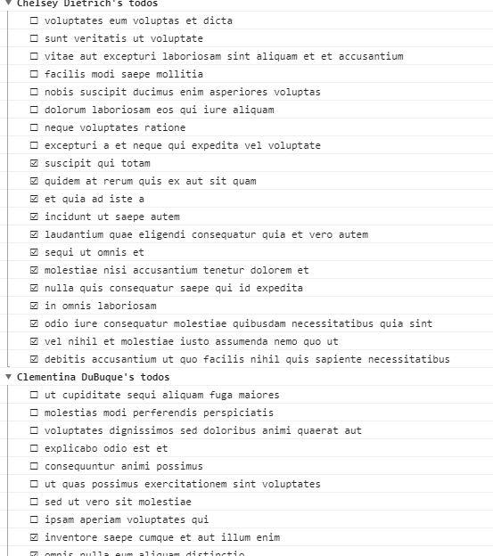
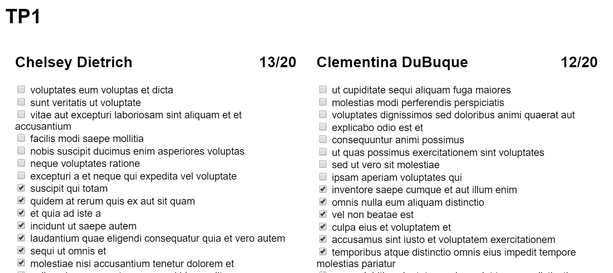

# TP1 : découverte du Javascript

Dans ce TP, nous allons manipuler des objets Todo renvoyés par l'API REST https://jsonplaceholder.typicode.com.

<!--
Notions couvertes:
- mode strict
- scope des fonctions
- déclaration const
- manipulation de tableau: filter, reduce, map, sort
- manipulation du DOM
- string template
- arrow functions
- classes ES6
- gestion des événements
- attributs data
-->

## 1ère partie

### Mise en place

- Créer un fichier `main.js` qui contiendra le code Javascript
- Créer un fichier `index.html` qui référence ce script

Quelques consignes :
- attention à l'emplacement de la balise script pour ne pas retarder le rendu de la page ;
- le code doit s'exécuter en mode strict ;
- on ne doit pas polluer l'objet global.

### Récupérer les données

Stocker dans une variable une liste de todos copiée/collée depuis https://jsonplaceholder.typicode.com/todos :
- la variable n'a pas besoin d'être modifiée

### Compter les todos `completed`

Afficher dans la console le nombre de todos à l'état `completed` :
- ne pas utiliser de boucle mais utiliser une fonction de [Array](https://developer.mozilla.org/docs/Web/JavaScript/Reference/Global_Objects/Array)

### Grouper les todos

Afficher dans la console les todos groupés par utilisateur et triés par nom d'utilisateur :

Pour cela :
- récupérer la liste des utilisateurs depuis [jsonplaceholder.typicode.com](https://jsonplaceholder.typicode.com) ;
- construire un objet qui associe à un `userId` la liste de ses todos, en utilisant la fonction [reduce](https://developer.mozilla.org/docs/Web/JavaScript/Reference/Global_Objects/Array/reduce) ;
- créer une classe `TodoList` qui définit les propriétés suivantes :
  - `user`
  - `todos`
  - `getCompleted(completed: boolean): Todo[]`
- Construire une liste de "todo list" en utilisant la fonction [map](https://developer.mozilla.org/docs/Web/JavaScript/Reference/Global_Objects/Array/map) sur la liste des utilisateurs.

## Bonus

## Afficher les todos

Afficher dans la page les todo lists :

Liens utiles :
- [document.createElement](https://developer.mozilla.org/docs/Web/API/Document/createElement)
- [innerHTML](https://developer.mozilla.org/docs/Web/API/Element/innerHTML) (💡 combiner avec les [string template](https://developer.mozilla.org/docs/Web/JavaScript/Reference/Template_literals))
- [checkbox](https://developer.mozilla.org/docs/Web/HTML/Element/Input/checkbox)

### Mise à jour d'un todo

Il s'agit de mettre à jour l'affichage lorsque l'on coche un todo. L'idée est de mettre à jour le modèle de données (la propriété `completed` d'un todo) puis refaire le rendu. Il faut donc pouvoir retrouver le todo associé à une case à cocher. Pour cela, on utilisera un [attribut data](https://developer.mozilla.org/docs/Learn/HTML/Howto/Use_data_attributes).

On s'assurera de ne brancher qu'__un seul__ écouteur d'événement avec [addEventListener](https://developer.mozilla.org/docs/Web/API/EventTarget/addEventListener).